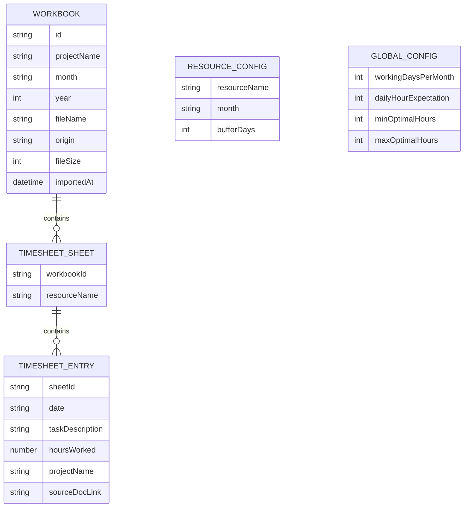

# Design Document: Resource Utilization Dashboard

## Overview

The Resource Utilization Dashboard is a React JS single-page application (SPA) that enables project managers to import Excel timesheet workbooks (from local disk or Google Drive), parse structured resource utilization data, and visualize it through interactive charts and configurable metrics. The application runs entirely in the browser with no backend server — all parsing, computation, and storage happen client-side using browser APIs and local storage.

**Key Design Decisions:**
- **Client-side only**: All Excel parsing, data aggregation, and chart rendering happen in the browser. No server infrastructure is needed.
- **Local Storage persistence**: Configuration (thresholds, working days, buffer days) and filter state persist via `localStorage`.
- **Library-driven charts**: Use a mature React charting library (Recharts) for interactive visualizations rather than building custom SVG/Canvas rendering.
- **SheetJS (xlsx)** for Excel parsing: Battle-tested library for reading .xlsx/.xls files in the browser.
- **TypeScript**: Full type safety across all modules for data integrity and developer experience.
- **Context + Reducer pattern**: Application state management using React Context with `useReducer` for predictable state updates across views.

## Architecture

The application follows a layered architecture separating data ingestion, business logic, state management, and presentation.

```mermaid
graph TD
    subgraph "Presentation Layer"
        A[Navigation Shell]
        B[Overview View]
        C[Projects View]
        D[Resources View]
        E[Monthly View]
        F[Metrics Panel]
        G[AI Insights Panel]
        H[Filter Bar]
        I[Configuration Panel]
    end

    subgraph "State Management Layer"
        J[AppContext + Reducer]
        K[Filter State]
        L[Config State]
    end

    subgraph "Business Logic Layer"
        M[Utilization Classifier]
        N[Metrics Calculator]
        O[Aggregation Engine]
        P[Filter Engine]
    end

    subgraph "Data Ingestion Layer"
        Q[Local File Parser]
        R[Google Drive Fetcher]
        S[Excel Parser Core]
        T[Filename Parser]
        U[Validation Module]
        V[JSON Serializer]
    end

    subgraph "External"
        W[Browser File API]
        X[Google Drive API]
        Y[localStorage]
        Z[AI Provider - Future]
    end

    A --> B & C & D & E
    B & C & D & E --> F & H
    B & C & D & E --> J
    J --> M & N & O & P
    M & N & O --> J
    Q --> S
    R --> S
    S --> T & U
    V --> S
    J --> Y
    L --> Y
    Q --> W
    R --> X
    G --> Z
end
```

### Layer Responsibilities

| Layer | Responsibility |
|-------|---------------|
| **Presentation** | React components, chart rendering, user interactions, routing |
| **State Management** | Centralized app state, dispatch actions, derived state selectors |
| **Business Logic** | Utilization classification, metric computation, data aggregation, filtering |
| **Data Ingestion** | File reading, Excel parsing, validation, serialization |

## Components and Interfaces

### Data Ingestion Components

#### `ExcelParserCore`
Central parsing engine that reads an Excel workbook and extracts structured timesheet data.

```typescript
interface ParseOptions {
  maxFileSizeMB: number; // Default: 50
  timeoutMs: number;     // Default: 10000
}

interface ParseResult {
  success: boolean;
  workbookMetadata: WorkbookMetadata;
  timesheets: TimesheetData[];
  warnings: ParseWarning[];
  errors: ParseError[];
}

interface ParseWarning {
  sheetName: string;
  type: 'skipped_sheet' | 'skipped_rows';
  message: string;
  details: string[]; // Row numbers or missing columns
}

interface ParseError {
  code: 'INVALID_FORMAT' | 'FILE_TOO_LARGE' | 'NO_VALID_DATA' | 'PARSE_TIMEOUT';
  message: string;
}

function parseWorkbook(file: File | ArrayBuffer, options?: ParseOptions): Promise<ParseResult>;
```

#### `FilenameParser`
Extracts project name and month from workbook filename convention.

```typescript
interface FilenameMetadata {
  projectName: string;
  month: string;  // Full month name e.g. "July"
  year: number;
  isValid: boolean;
}

function parseFilename(filename: string): FilenameMetadata;
```

#### `GoogleDriveFetcher`
Downloads Excel files from Google Drive sharing links.

```typescript
interface FetchResult {
  success: boolean;
  file?: ArrayBuffer;
  fileName?: string;
  fileSize?: number;
  error?: {
    code: 'INVALID_LINK' | 'ACCESS_DENIED' | 'NETWORK_ERROR' | 'TIMEOUT' | 'FILE_TOO_LARGE';
    message: string;
  };
}

function fetchFromGoogleDrive(url: string, timeoutMs?: number): Promise<FetchResult>;
```

#### `JSONSerializer`
Handles round-trip serialization of parsed timesheet data.

```typescript
interface SerializationResult {
  success: boolean;
  json?: string;
  error?: string;
}

interface DeserializationResult {
  success: boolean;
  data?: ParsedWorkbookCollection;
  errors?: ValidationError[];
}

function serialize(data: ParsedWorkbookCollection): SerializationResult;
function deserialize(json: string): DeserializationResult;
```

### Business Logic Components

#### `UtilizationClassifier`
Classifies resources based on configured thresholds and buffer days.

```typescript
type UtilizationCategory = 'over-utilized' | 'under-utilized' | 'optimally-utilized';

interface ThresholdConfig {
  minOptimalHours: number; // Default: 140
  maxOptimalHours: number; // Default: 176
}

interface BufferConfig {
  workingDaysPerMonth: number;  // Default: 22
  dailyHourExpectation: number; // Default: 8
  bufferDays: number;           // Default: 0, per resource
}

interface ClassificationResult {
  category: UtilizationCategory;
  totalHours: number;
  effectiveAvailableHours: number;
  utilizationPercentage: number;
}

function classifyResource(
  totalHours: number,
  thresholds: ThresholdConfig,
  bufferConfig: BufferConfig
): ClassificationResult;
```

#### `MetricsCalculator`
Computes the top 5 metrics and trend indicators.

```typescript
interface DashboardMetrics {
  averageUtilizationPercentage: number;
  overUtilizedCount: number;
  underUtilizedCount: number;
  totalAvailableCapacityHours: number;
  highestUtilizedResource: string;
}

interface MetricWithTrend {
  value: number | string;
  trend: 'up' | 'down' | 'neutral' | null; // null = no previous data
}

function calculateMetrics(
  timesheets: AggregatedResourceData[],
  thresholds: ThresholdConfig,
  bufferConfigs: Map<string, BufferConfig>,
  previousMonthData?: AggregatedResourceData[]
): Record<keyof DashboardMetrics, MetricWithTrend>;
```

#### `AggregationEngine`
Aggregates raw timesheet data across projects, resources, and months.

```typescript
interface AggregatedResourceData {
  resourceName: string;
  month: string;
  year: number;
  totalHours: number;
  projects: { projectName: string; hours: number }[];
  taskCount: number;
}

function aggregateByResource(timesheets: TimesheetData[]): AggregatedResourceData[];
function aggregateByProject(timesheets: TimesheetData[]): AggregatedProjectData[];
function aggregateByMonth(timesheets: TimesheetData[]): AggregatedMonthData[];
```

#### `FilterEngine`
Applies multi-dimensional filters with AND/OR logic.

```typescript
interface FilterState {
  projects: string[];         // OR within
  resources: string[];        // OR within
  months: string[];           // OR within (format: "Month Year")
  categories: UtilizationCategory[]; // OR within
}
// AND logic applied BETWEEN dimensions

function applyFilters(
  data: AggregatedResourceData[],
  filters: FilterState
): AggregatedResourceData[];
```

### Presentation Components

#### Navigation Shell
```typescript
// Tab-based navigation: Overview | Projects | Resources | Monthly
interface NavigationProps {
  activeView: 'overview' | 'projects' | 'resources' | 'monthly';
  onViewChange: (view: string) => void;
}
```

#### Chart Components
- `UtilizationBarChart` — Bar chart with color-coded utilization categories
- `DistributionDonutChart` — Donut chart with percentage labels and center count
- `TrendLineChart` — Line chart with threshold band overlay
- `StackedBarChart` — Project-wise stacked bar by month
- `HeatmapGrid` — Calendar heatmap for daily hours
- `HorizontalBarChart` — Resource-wise per-project hours

#### AI Integration Hook

```typescript
interface AIInsight {
  title: string;       // max 100 chars
  description: string; // max 500 chars
  severity: 'low' | 'medium' | 'high';
}

interface AIProviderInput {
  resourceName: string;
  projectName: string;
  month: string;
  totalHours: number;
  utilizationCategory: UtilizationCategory;
  effectiveAvailableHours: number;
}

interface AIProvider {
  generateInsights(data: AIProviderInput[]): Promise<AIInsight[]>;
}

// Hook for future AI integration
const AI_INTEGRATION_TIMEOUT_MS = 15000;
```

## Data Models

### Core Data Entities



### TypeScript Data Models

```typescript
// Workbook metadata
interface WorkbookMetadata {
  id: string;                // UUID
  projectName: string;
  month: string;             // "July"
  year: number;              // 2026
  fileName: string;
  origin: 'local' | 'google-drive';
  fileSize: number;          // bytes
  importedAt: string;        // ISO 8601 datetime
  resourceCount: number;
}

// Individual timesheet entry (one row in a sheet)
interface TimesheetEntry {
  date: string;              // ISO 8601 date "2026-07-15"
  taskDescription: string;   // max 500 chars
  hoursWorked: number;       // 0-24
  projectName: string;
  sourceDocLink: string;     // valid URL or ""
}

// A resource's full timesheet for one workbook
interface TimesheetData {
  workbookId: string;
  resourceName: string;
  entries: TimesheetEntry[];
}

// Aggregated data for a resource in a given month
interface AggregatedResourceData {
  resourceName: string;
  month: string;
  year: number;
  totalHours: number;
  projects: ProjectHours[];
  taskCount: number;
  effectiveAvailableHours: number;
  utilizationCategory: UtilizationCategory;
  utilizationPercentage: number;
}

interface ProjectHours {
  projectName: string;
  hours: number;
}

// Aggregated project data
interface AggregatedProjectData {
  projectName: string;
  month: string;
  year: number;
  totalHours: number;
  activeResourceCount: number;
  resources: { resourceName: string; hours: number; category: UtilizationCategory }[];
  averageUtilizationPercentage: number;
}

// Aggregated monthly data
interface AggregatedMonthData {
  month: string;
  year: number;
  totalTeamHours: number;
  totalAvailableCapacity: number;
  overallUtilizationPercentage: number;
  categoryCounts: Record<UtilizationCategory, number>;
  resources: AggregatedResourceData[];
}

// Configuration persisted to localStorage
interface AppConfig {
  thresholds: ThresholdConfig;
  workingDaysPerMonth: number;
  dailyHourExpectation: number;
  resourceBufferDays: Record<string, Record<string, number>>; // resourceName -> month -> days
}

// JSON serialization format for round-trip
interface SerializedWorkbookCollection {
  version: string;  // Schema version for forward compatibility
  workbooks: {
    [projectMonthKey: string]: {  // e.g., "ProjectAlpha_July_2026"
      metadata: WorkbookMetadata;
      resources: {
        [resourceName: string]: TimesheetEntry[];
      };
    };
  };
}

// Application state shape
interface AppState {
  workbooks: WorkbookMetadata[];
  timesheets: TimesheetData[];
  config: AppConfig;
  filters: FilterState;
  activeView: 'overview' | 'projects' | 'resources' | 'monthly';
  aiInsights: AIInsight[];
  aiStatus: 'idle' | 'loading' | 'error' | 'unavailable';
}
```

### State Management Actions

```typescript
type AppAction =
  | { type: 'IMPORT_WORKBOOK'; payload: { metadata: WorkbookMetadata; timesheets: TimesheetData[] } }
  | { type: 'REMOVE_WORKBOOK'; payload: { workbookId: string } }
  | { type: 'UPDATE_THRESHOLDS'; payload: ThresholdConfig }
  | { type: 'UPDATE_WORKING_DAYS'; payload: number }
  | { type: 'UPDATE_DAILY_HOURS'; payload: number }
  | { type: 'UPDATE_BUFFER_DAYS'; payload: { resourceName: string; month: string; days: number } }
  | { type: 'SET_FILTERS'; payload: Partial<FilterState> }
  | { type: 'CLEAR_FILTERS' }
  | { type: 'SET_VIEW'; payload: AppState['activeView'] }
  | { type: 'SET_AI_INSIGHTS'; payload: AIInsight[] }
  | { type: 'SET_AI_STATUS'; payload: AppState['aiStatus'] };
```

## Correctness Properties

*A property is a characteristic or behavior that should hold true across all valid executions of a system — essentially, a formal statement about what the system should do. Properties serve as the bridge between human-readable specifications and machine-verifiable correctness guarantees.*

### Property 1: Utilization Classification Completeness

*For any* valid threshold configuration (where min < max) and *for any* non-negative total hours value, the classification function SHALL return exactly one of the three categories: "under-utilized" if hours < min, "over-utilized" if hours > max, or "optimally-utilized" if min <= hours <= max — and the result must be deterministic for the same inputs.

**Validates: Requirements 5.2, 5.3, 5.4, 5.8**

### Property 2: Serialization Round-Trip Preservation

*For any* valid `ParsedWorkbookCollection` containing arbitrary workbook metadata, resource names, and timesheet entries, serializing to JSON and then deserializing back SHALL produce a data structure that is field-by-field equivalent to the original, preserving: all data types, the sheet-to-resource mapping, and the workbook-to-project-month association.

**Validates: Requirements 14.1, 14.2, 14.3**

### Property 3: Filter AND/OR Logic Correctness

*For any* dataset of aggregated resource data and *for any* combination of active filters across dimensions (projects, resources, months, categories), every item in the filtered result SHALL satisfy ALL active filter dimensions (AND between dimensions) and match at least one selected value within each active dimension (OR within dimension). Additionally, no item satisfying these criteria shall be excluded from the result.

**Validates: Requirements 11.2, 11.3**

### Property 4: Sheet Conformance Detection

*For any* workbook sheet with a header row, the parser SHALL mark the sheet as non-conforming if and only if one or more of the five required columns ("Date", "Task Description", "Hours Worked", "Project Name", "Source Document Link") is missing from the header row (case-insensitive matching). The reported missing columns list SHALL exactly equal the set difference between the required columns and the present columns.

**Validates: Requirements 1.3, 3.2, 3.3**

### Property 5: Configuration Persistence Round-Trip

*For any* valid application configuration (thresholds where min < max, working days 1-31, daily hours 1-24, buffer days per resource where bufferDays < workingDays), saving to localStorage and then loading back SHALL produce a configuration object equivalent to the original.

**Validates: Requirements 5.5, 6.7**

### Property 6: Effective Available Hours Calculation

*For any* valid combination of working days (1-31), buffer days (0 to workingDays - 1), and daily hour expectation (1-24), the effective available hours SHALL equal exactly (workingDays - bufferDays) × dailyHourExpectation.

**Validates: Requirements 6.4**

### Property 7: Cross-Project Resource Aggregation

*For any* set of imported workbooks containing timesheet data for the same resource name (case-insensitive matching), the aggregated total hours for that resource in a given month SHALL equal the sum of hours from all individual workbook entries for that resource in that month.

**Validates: Requirements 4.2**

### Property 8: Filename Convention Parsing Round-Trip

*For any* valid project name (non-empty string without underscores), valid full English month name, and valid 4-digit year, constructing a filename using the convention `{ProjectName}_{Month}_{Year}.xlsx` and then parsing it SHALL extract the original project name, month, and year.

**Validates: Requirements 3.4**

### Property 9: Threshold Validation Invariant

*For any* pair of integer values (min, max) where min >= max, the threshold configuration SHALL be rejected. Conversely, *for any* pair where min < max and both are within 0-744 inclusive, the configuration SHALL be accepted.

**Validates: Requirements 5.7**

### Property 10: Metrics Calculation Consistency

*For any* set of aggregated resource data with at least 2 resources, the metrics SHALL satisfy: average utilization percentage equals (sum of all total hours / sum of all effective available hours) × 100, over-utilized count equals the count of resources classified as over-utilized, under-utilized count equals the count of resources classified as under-utilized, and available capacity equals the sum of (effective available hours - actual hours) across all resources.

**Validates: Requirements 12.1**

### Property 11: Deserialization Error Reporting

*For any* JSON string that is missing one or more required fields or contains fields with incorrect data types relative to the schema, the deserializer SHALL return a validation error listing the specific failing fields rather than producing partial data or a silent success.

**Validates: Requirements 14.4**

### Property 12: Google Drive URL Pattern Validation

*For any* URL string, the validator SHALL accept it if and only if it matches the pattern `https://drive.google.com/file/d/{fileId}` or `https://docs.google.com/spreadsheets/d/{fileId}` where `{fileId}` is a non-empty string. All other URLs SHALL be rejected with the "Invalid Google Drive link format" error.

**Validates: Requirements 2.1, 2.2**

### Property 13: Invalid Row Skipping Preserves Valid Data

*For any* timesheet sheet containing a mix of valid rows (valid date and numeric hours 0-24) and invalid rows (null/empty/non-date in Date column, or null/empty/non-numeric in Hours Worked column), the parser SHALL include exactly the valid rows in the result and skip exactly the invalid rows, with the warning listing the correct row numbers and reasons.

**Validates: Requirements 3.6**

### Property 14: AI Insights Severity Ordering

*For any* array of AI insight objects with mixed severity values, sorting them for display SHALL always produce an ordering where all "high" severity insights appear before all "medium" severity insights, which appear before all "low" severity insights.

**Validates: Requirements 13.4**

### Property 15: Filter State Preservation Across Views

*For any* filter state and *for any* sequence of view navigation actions (switching between overview, projects, resources, monthly), the filter state SHALL remain unchanged after navigation.

**Validates: Requirements 11.7**

### Property 16: Category Distribution Percentages Sum

*For any* non-empty set of classified resources, the donut chart percentage values for over-utilized, under-utilized, and optimally-utilized SHALL sum to 100% (within floating-point rounding tolerance of ±0.1%).

**Validates: Requirements 7.2**

### Property 17: Alphabetical Tiebreaker for Highest Utilization

*For any* set of resources where two or more resources are tied for the highest total hours worked, the metrics panel SHALL display the resource whose name comes first in case-insensitive alphabetical order.

**Validates: Requirements 12.6**

### Property 18: Buffer Days Validation

*For any* buffer days value that is greater than or equal to the configured working days, the system SHALL reject the input. *For any* buffer days value from 0 to (workingDays - 1) inclusive, the system SHALL accept the input.

**Validates: Requirements 6.6**

### Property 19: Duplicate Project-Month Detection

*For any* two workbooks where the project name (case-insensitive) and month-year combination match, the system SHALL detect the conflict and prompt the user to replace or cancel.

**Validates: Requirements 4.5**

### Property 20: Resource Name Whitespace Trimming

*For any* sheet name string, the resulting resource engineer name SHALL equal the original string with all leading and trailing whitespace removed, and the trimmed name SHALL never start or end with whitespace characters.

**Validates: Requirements 3.1**

## Error Handling

### Error Categories and Recovery Strategies

| Error Type | Source | User Message | Recovery |
|-----------|--------|--------------|----------|
| Invalid file format | File picker / Google Drive | "Unsupported file format. Please select a valid .xlsx or .xls file" | Allow re-selection |
| File too large | File picker / Google Drive | "Maximum supported file size is 50 MB" | Allow re-selection |
| No valid sheets | Parser | "No valid timesheet data was found in the file" | Show which sheets were skipped and why |
| Network timeout | Google Drive fetch | "Download failed due to a network issue. Please check your connection and try again" | Retry button |
| Permission denied | Google Drive fetch | "File could not be retrieved. Please verify the link has public or shared access enabled" | Allow link correction |
| Invalid Drive URL | URL input | "Invalid Google Drive link format. Please provide a valid sharing link" | Allow re-entry |
| Threshold validation | Config panel | "Minimum must be less than the maximum" | Prevent save, keep form open |
| Buffer validation | Config panel | "Buffer_Days must be less than Working_Days" | Prevent save, highlight field |
| AI provider timeout | AI Integration | "Unable to retrieve AI insights at this time" | Continue without AI, show placeholder |
| Malformed JSON | Deserialization | Validation error listing specific failing fields | Show error details, allow re-import |

### Error Handling Principles

1. **Graceful degradation**: Errors in one module (e.g., AI integration) must never disrupt other features.
2. **Partial success**: When some sheets are valid and others aren't, process the valid ones and report warnings for the rest.
3. **User-actionable messages**: Every error message tells the user what to do next.
4. **No silent failures**: Invalid rows, skipped sheets, and validation issues are always reported in a warning summary.
5. **State consistency**: Failed operations (rejected imports, invalid configs) never modify application state.

### Validation Boundaries

```typescript
// Input validation constants
const VALIDATION_LIMITS = {
  MAX_FILE_SIZE_MB: 50,
  MAX_WORKBOOKS: 20,
  MAX_TASK_DESCRIPTION_LENGTH: 500,
  MIN_HOURS: 0,
  MAX_HOURS: 24,
  MIN_THRESHOLD: 0,
  MAX_THRESHOLD: 744,
  MIN_WORKING_DAYS: 1,
  MAX_WORKING_DAYS: 31,
  MIN_DAILY_HOURS: 1,
  MAX_DAILY_HOURS: 24,
  GOOGLE_DRIVE_TIMEOUT_MS: 30000,
  AI_PROVIDER_TIMEOUT_MS: 15000,
  PARSE_TIMEOUT_MS: 10000,
  MAX_AI_INSIGHTS: 20,
  MAX_INSIGHT_TITLE_LENGTH: 100,
  MAX_INSIGHT_DESCRIPTION_LENGTH: 500,
};
```

## Testing Strategy

### Dual Testing Approach

This project uses both unit tests (example-based) and property-based tests for comprehensive coverage.

#### Property-Based Testing

**Library**: [fast-check](https://github.com/dubzzz/fast-check) — the most mature property-based testing library for TypeScript/JavaScript.

**Configuration**: Minimum 100 iterations per property test (fast-check default is 100, we keep it).

**Tag format**: Each property test will include a comment referencing the design property:
```typescript
// Feature: resource-utilization-dashboard, Property {N}: {property_text}
```

**Property tests cover**:
- Utilization classification logic (Property 1)
- Serialization round-trip (Property 2)
- Filter AND/OR logic (Property 3)
- Sheet conformance detection (Property 4)
- Configuration persistence (Property 5)
- Effective hours calculation (Property 6)
- Cross-project aggregation (Property 7)
- Filename parsing round-trip (Property 8)
- Threshold validation (Property 9)
- Metrics calculation (Property 10)
- Deserialization error reporting (Property 11)
- Google Drive URL validation (Property 12)
- Invalid row skipping (Property 13)
- AI insights ordering (Property 14)
- Filter state preservation (Property 15)
- Category distribution percentages (Property 16)
- Alphabetical tiebreaker (Property 17)
- Buffer days validation (Property 18)
- Duplicate detection (Property 19)
- Whitespace trimming (Property 20)

#### Unit Tests (Example-Based)

**Framework**: Vitest (fast, TypeScript-native, compatible with React Testing Library)

**Unit tests cover**:
- Default configuration values (5.6, 6.1, 6.3)
- Google Drive permission/network error handling (2.3, 2.4)
- UI empty states (7.6, 8.6, 9.5, 9.6, 10.5, 11.6)
- Color mapping for utilization categories (7.1)
- Non-conforming filename behavior (3.5)
- File size boundary checks (1.5, 2.6)
- Metrics minimum resource requirement (12.5)
- AI placeholder display (13.2)
- Tooltip data structure (7.4)

#### Integration Tests

**Framework**: Vitest + React Testing Library

**Integration tests cover**:
- Full file import flow (local + Google Drive mock)
- Threshold update → reclassification cycle
- Filter application → chart data update
- Workbook removal → metrics recalculation
- View navigation with persistent filters

### Test Organization

```
src/
├── __tests__/
│   ├── properties/              # Property-based tests
│   │   ├── classification.property.test.ts
│   │   ├── serialization.property.test.ts
│   │   ├── filters.property.test.ts
│   │   ├── parser.property.test.ts
│   │   ├── config.property.test.ts
│   │   ├── aggregation.property.test.ts
│   │   ├── metrics.property.test.ts
│   │   └── validation.property.test.ts
│   ├── unit/                    # Example-based unit tests
│   │   ├── excelParser.test.ts
│   │   ├── filenameParser.test.ts
│   │   ├── googleDriveFetcher.test.ts
│   │   ├── utilizationClassifier.test.ts
│   │   ├── metricsCalculator.test.ts
│   │   └── jsonSerializer.test.ts
│   └── integration/             # Integration tests
│       ├── importFlow.test.ts
│       ├── configUpdate.test.ts
│       └── filterNavigation.test.ts
```

### Technology Stack Summary

| Concern | Technology |
|---------|-----------|
| Framework | React 18 + TypeScript |
| Build | Vite |
| State | React Context + useReducer |
| Charts | Recharts |
| Excel Parsing | SheetJS (xlsx) |
| Styling | Tailwind CSS |
| Testing | Vitest + fast-check + React Testing Library |
| Linting | ESLint + Prettier |
| Routing | React Router v6 (hash routing for SPA) |

